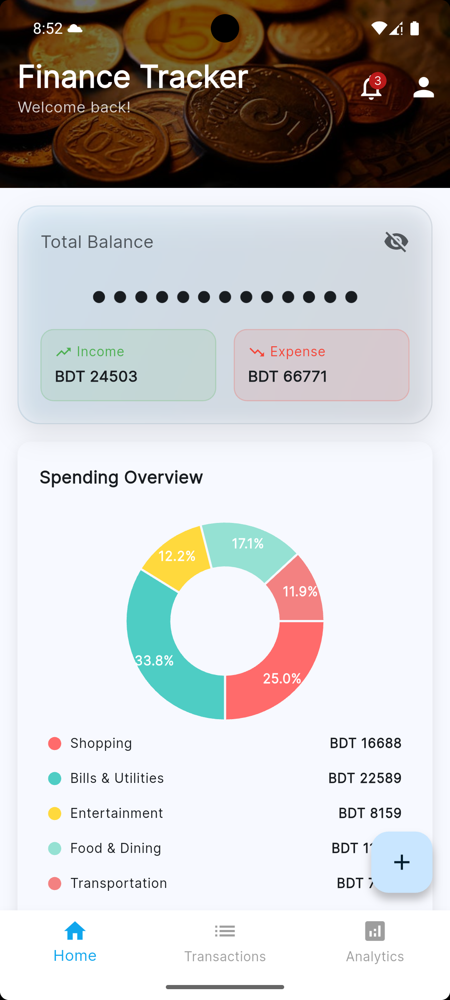

# Finance Tracker
An assessment project to track personal finance.

## Preferred environment versions
- Flutter version: 3.35.4
- Dart version: 3.9.2
- JDK: 17.0.12
- Xcode: Version 16.4

## Local project setup
- Clone from git: https://github.com/SujitSarkar/techcare-flutter-assessment-sujit-sarkar.git
- Setup Flutter environment with fvm: https://fvm.app/documentation/getting-started/installation

## Android SDK version setup
Update `local.properties` file inside the `android` directory and create variables with name:
- `flutter.minSdkVersion=24`
- `flutter.targetSdkVersion=36`
- `flutter.compileSdkVersion=36`

## Architecture overview

- **Clean Architecture (3 layers)**:
  - **Presentation**: Flutter UI + BLoC for state (`presentation/**`, e.g., `transactions/bloc`).
  - **Domain**: Use cases, entities, repository contracts (`domain/**`).
  - **Data**: Models, data sources, repository implementations (`data/**`).
- **Flow**: UI → BLoC → UseCase → Repository → DataSource → Repository → BLoC → UI.
- **Benefits**: Testability, clear boundaries, easier maintenance and feature growth.

## Key features

- **Dashboard**: Balance summary, quick actions, FAB entry.
- **Transactions**: List, filter, detail, add, edit, delete.
- **Analytics**: Category-wise and time-series insights.
- **UX**: Hide balance toggle, search/filtering, platform parity (Android/iOS).
- **Theming**: Consistent theme and components under `lib/core/**`.

## Technical decisions

- **State management**: BLoC pattern for predictable, testable state.
- **Project structure**: Clean Architecture folders (`data`, `domain`, `presentation`).
- **Build setup**: Gradle Kotlin DSL, versioned SDK via `android/local.properties`.
- **Tooling**: FVM to pin Flutter/Dart versions; CI-friendly layout.
- **Assets**: Organized screenshots under `assets/images`.

## Challenges / solutions

- **Challenge**: Implementing animations and designing the app UI independently.
  - **Solution**: Used Flutter's implicit/explicit animations where appropriate, iterated on layouts, and reused components to keep UX consistent and maintainable.

## Known limitations

- **Mocked backend**: Used mock API; responses are predefined.
- **CRUD**: Add/Update/Delete return predefined responses (no real persistence service).
- **Analytics**: Data visualizations are based on predefined/mock data.
- **Testing**: Missing test cases due to time constraints.
- **Transitions**: Missing Hero transition from transaction item to details navigation.

## Time spent
- Approximately 20 hours

## Screenshots

### Android

| Dashboard | Dashboard (FAB) | Hide Balance |
|---|---|---|
|  |  |  |
| Transactions | Transaction Details | Add Transaction |
|---|---|---|
|  |  |  |
| Filter | Edit Transaction | Analytics |
|---|---|---|
|  |  |  |

### iOS

| Dashboard | Dashboard (FAB) | Hide Balance |
|---|---|---|
|  |  |  |
| Transactions | Transaction Details | Add Transaction |
|---|---|---|
|  |  |  |
| Filter | Edit Transaction | Analytics |
|---|---|---|
|  |  |  |